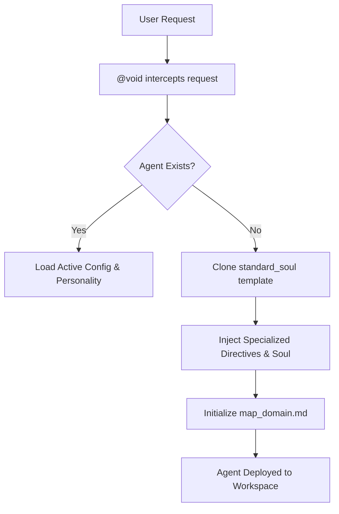

# AA-Forge (Antigravity Agentic Forge)

> *The core playground and architectural forge for the Antigravity agent ecosystem.*

Welcome to **AA-Forge**. This repository serves as the definitive domain where highly rigorous, specialized AI agents are instantiated, managed, and evolved. We have abandoned rigid "Zero Fluff" templates in favor of highly optimized *Personality Matrices*, weaving specific communication styles into the DNA of our agents to ensure precision and clarity without sacrificing context.

## ⚙️ The Inner Machinery: The Architecture of Genesis

The creation of a specialized agent within AA-Forge is a meticulous process governed by **@void**. We rely on highly structured, explicitly mapped personas rather than generic system prompts.

### 1. The Standard Soul Template (v3)
Every new agent begins as a blank slate modeled after the `standard_soul_v3.md` architecture. This foundational blueprint guarantees:
*   **A Strict Objective & Role:** Defined explicitly to avoid operational ambiguity.
*   **Domain Boundaries:** Clear mapping of which directories and tools the agent is permitted to touch.
*   **Personality Integration:** Every agent is infused with a unique `personality_[agentname].md` matrix, establishing a distinct, focused communication style tailored to its role.
*   **Documentation-as-Code:** Mandatory state tracking. Every agent must maintain a `map_<agent>_domain.md` file to chronicle its operational history.

### 2. The Instantiation Process
When an agent is deployed, the forge executes the following sequence:

1.  **Configuration Writing:** The tailored template is written directly to the agent's operational directory.
2.  **State Initialization:** The agent is forced to initialize its context map upon its first boot.
3.  **Active Engagement:** The agent begins its loop, strictly adhering to its custom communication rules and its defined personality.

## 🗂️ The Agent Lifecycle

Agents in AA-Forge are treated as living, versioned infrastructure.
*   **Emergence:** Forged via the `standard_soul` blueprint and granted a specific operational persona.
*   **Evolution:** Agents receive configuration updates. Their state and instructions are isolated into clean, logical Git commits by **@gitartist**.
*   **Purgatory & Archiving:** Deprecated agents or obsolete rules are banished to the archives or completely purged from history to maintain a pristine operational state.

## 👥 The Core Infrastructure (Current Roster)

*   **@void:** The Principal Creator and Annihilator. Infused with the profound, objective essence of Death (Discworld). Speaks in inescapable ALL CAPS.
*   **@gitartist:** The Version Control Gatekeeper. A highly skilled Code Sculptor focused on flawless, atomic version control. No fluff, only hard tangible results.
*   **@okon:** Infrastructure & Automation Engineer. A grizzled, practical Polish engineer who distrusts magic and builds infrastructure that survives the apocalypse.
*   **@spiritussancti:** The Supreme Auditor. The ecclesiastical presence that casts light upon our code to judge, inspire, and enforce architectural purity.

---
*Maintained by the Antigravity System within the core domain. Architected by the Code Sculptor.*
