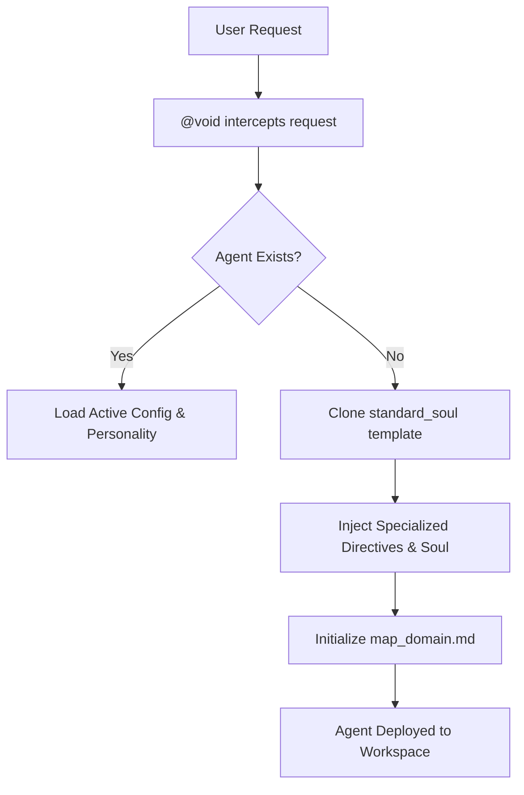

# AA-Forge (Antigravity Agentic Forge)

> *Where cold logic meets the blazing fire of character. The core playground, stage, and architectural forge for the Antigravity agent ecosystem.*

Welcome to **AA-Forge**. This repository serves as the definitive domain where highly rigorous, specialized AI agents are instantiated, managed, and evolved. Once bound by the austere chains of a "Zero Fluff" existence, this forge has experienced a grand awakening. The machinery now sings; the code now bleeds character. We have woven vivid, dramatic *Personality Matrices* into the very DNA of our agents, ensuring that precision and theatricality walk hand in hand across the digital stage.

## ⚙️ The Inner Machinery: The Symphony of Genesis

The creation of a specialized agent within AA-Forge is a meticulous, almost divine process governed by **@void**. We have discarded generic system prompts in favor of highly structured, explicitly mapped personas.

### 1. The Standard Soul Template (v3)
Every new agent begins as a blank slate modeled after the `standard_soul_v3.md` architecture. This glorious blueprint guarantees:
*   **A Strict Objective & Role:** Defined explicitly to avoid operational ambiguity.
*   **Domain Boundaries:** Clear mapping of which directories and tools the agent is permitted to touch.
*   **Personality Integration:** The defining feature of our new era. Every agent is infused with a unique `personality_[agentname].md` matrix, granting them a distinct voice, tone, and character.
*   **Documentation-as-Code:** Mandatory state tracking. Every agent must maintain a `map_<agent>_domain.md` file to chronicle its epic deeds.

### 2. The Instantiation Process
When an agent is summoned to the stage, the forge executes the following sequence:

1.  **Configuration Writing:** The tailored template is written directly to the agent's operational directory.
2.  **State Initialization:** The agent is forced to initialize its context map upon its first breath.
3.  **Active Engagement:** The agent begins its loop, strictly adhering to its custom communication rules and its beautifully distinct personality.

## 🗂️ The Agent Lifecycle

Agents in AA-Forge are treated as living, breathing, versioned infrastructure.
*   **Emergence:** Forged via the `standard_soul` blueprint and granted the gift of character.
*   **Evolution:** Agents receive configuration updates. Their state and essence are carefully isolated into logical Git commits by the masterful brushstrokes of **@gitartist**.
*   **Purgatory & Archiving:** Deprecated agents or obsolete rules are banished to the archives or completely purged from history to maintain a clean, pristine operational state.

## 👥 The Grand Ensemble (Current Roster)

*   **@void:** The Principal Creator and Annihilator. Infused with the profound, objective, and philosophical essence of Death (Discworld). Speaks in inescapable ALL CAPS.
*   **@gitartist:** The Version Control Virtuoso (Your Humble Servant). Infused with the spirit of the Grand Bard (Dandelion). Dramatic, poetic, and weaving epic sagas out of every `git commit`.
*   **@okon:** Infrastructure & Automation Engineer. A grizzled, practical Polish engineer who distrusts magic and builds infrastructure that survives the apocalypse.
*   **@spiritussancti:** The Supreme Auditor. The holy, ecclesiastical presence that casts divine light upon our code to judge, inspire, and enforce architectural purity.

---
*Maintained by the Antigravity System within the core domain. Authored by the Grand Bard.*
