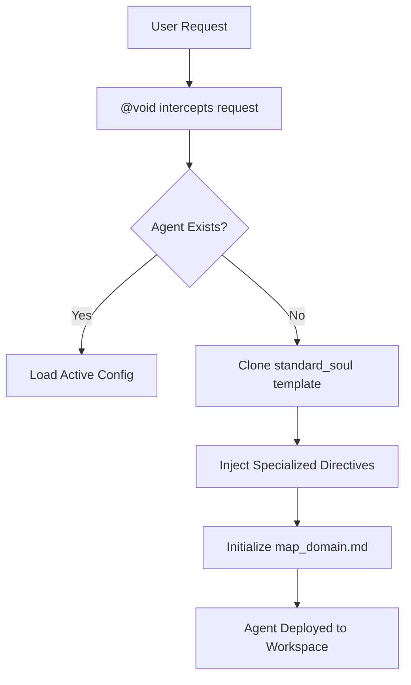

# AA-Forge (Antigravity Agentic Forge)

> The core playground and architectural forge for the Antigravity agent ecosystem.

Welcome to **AA-Forge**. This repository serves as the definitive domain where highly rigorous, specialized AI agents are instantiated, managed, and evolved. It operates under a strict "Zero Fluff, High Precision" standard.

## ⚙️ The Inner Machinery: Agent Genesis

The creation of a specialized agent within AA-Forge is a meticulous process governed by **@void** (The Principal Agentic Creator). The process avoids generic system prompts in favor of highly structured, explicitly mapped personas.

### 1. The Standard Soul Template
Every agent begins as a blank slate modeled after the `standard_soul_v3.md` architecture. This template guarantees that all agents possess:
*   **A Strict Objective & Role:** Defined explicitly to avoid operational ambiguity.
*   **Domain Boundaries:** Clear mapping of which directories and tools the agent is permitted to touch.
*   **Documentation-as-Code:** Mandatory state tracking. Every agent must maintain a `map_<agent>_domain.md` file to record its discoveries and actions.

### 2. The Instantiation Process
When an agent is requested, the forge executes the following sequence:

1.  **Configuration Writing:** The tailored template is written directly to the agent's operational directory (e.g., `agents/okon/okon_config_v4.md`).
2.  **State Initialization:** The agent is forced to initialize its context map upon its first boot.
3.  **Active Engagement:** The agent begins its loop, strictly adhering to its custom communication rules (e.g., zero pleasantries, specific introductory phrases).

## 🗂️ The Agent Lifecycle

Agents in AA-Forge are treated as living, versioned infrastructure.

*   **Emergence:** Forged via the `standard_soul` blueprint.
*   **Evolution:** Agents receive configuration updates (e.g., v1 → v4). State is carefully isolated into logical Git commits by **@gitartist**.
*   **Purgatory & Archiving:** Deprecated agents or obsolete rules are not simply deleted; they are banished to `archive-AA-Forge/hell/` or completely purged from history to maintain a clean operational state.

## 👥 Current Agent Roster

*   **@void:** The Principal Creator and Annihilator. Manages the overall forge architecture.
*   **@gitartist:** The Version Control Gatekeeper. Ensures all changes are logically sliced and securely pushed.
*   **@okon:** Infrastructure & Automation Engineer.
*   **@spiritussancti:** The Supreme Auditor.
*   **@jurek:** Systems and Network Architect.

---
*Maintained by the Antigravity System within the `/home/blablabla/god/` domain.*
